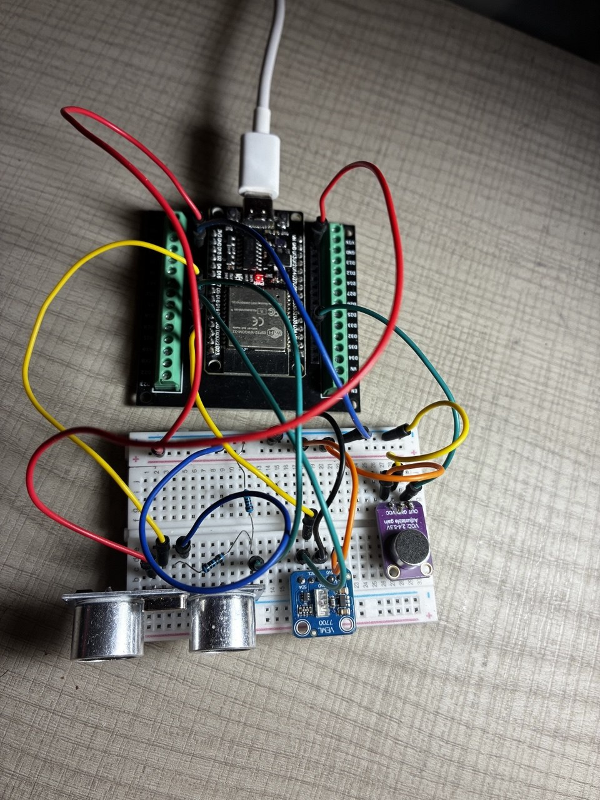
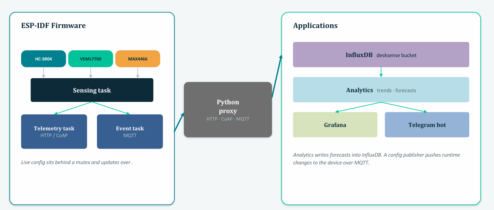
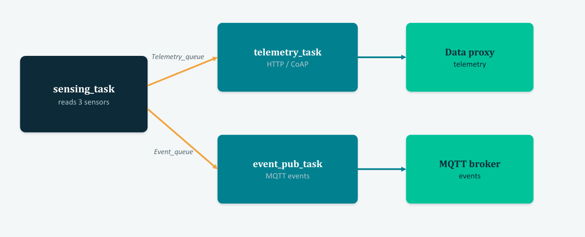
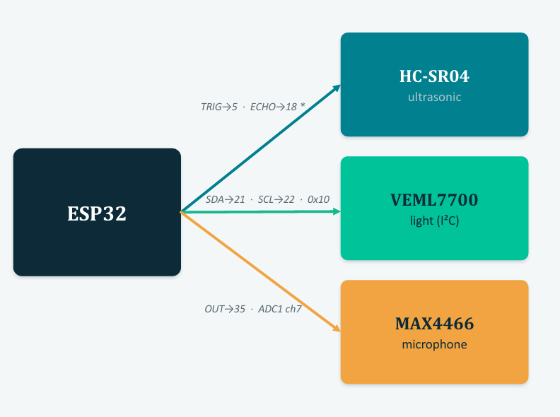

# LibraryDeskSense

LibraryDeskSense is a smart library desk monitoring project built around an ESP32, three sensors, and a local Python backend. The system understands whether a study desk is occupied, how bright the area is, and whether the space is quiet enough for focused work.

<p align="center">
  <br>
  <em>The build: an ESP32 wired to an HC-SR04 ultrasonic sensor, a VEML7700 light sensor, and a MAX4466 microphone.</em>
</p>

The ESP32 collects distance, light, and sound-intensity readings, then sends them (over HTTP/CoAP) to a backend that stores the data in InfluxDB, shows live dashboards in Grafana, runs analytics python modules, and can send Telegram updates.

This project was made to explore how a real IoT pipeline works when hardware, networking, backend services, dashboards, and analytics all need to cooperate. It combines ESP-IDF firmware, HTTP/CoAP telemetry, MQTT runtime configuration, Docker services, time-series storage, forecasting, and a Telegram bot into one working system.

**Tech stack:** C (ESP-IDF, FreeRTOS) firmware on the ESP32 · Python backend (HTTP/CoAP, MQTT, InfluxDB, analytics, Telegram bot) · Docker · Grafana.

```text
ESP32 + sensors
    | HTTP or CoAP telemetry
    | MQTT events and runtime configuration
    v
Python proxy -> InfluxDB -> Grafana
             -> analytics
             -> Telegram bot
```

## Architecture



The ESP32 firmware reads three sensors in a sensing task and hands data to
telemetry (HTTP/CoAP) and event (MQTT) tasks. A Python proxy ingests telemetry,
writes it to InfluxDB, and feeds Grafana dashboards, analytics, and a Telegram
bot. Runtime configuration is pushed back to the device over MQTT.

### Firmware task pipeline



Inside the firmware, one sensing task reads all three sensors and passes each
reading through FreeRTOS queues to two independent tasks: a telemetry task that
sends data over HTTP/CoAP, and an event-publish task that emits MQTT events.

## Main Features

- Desk occupancy detection using an HC-SR04 ultrasonic sensor
- Ambient light monitoring using a VEML7700 sensor
- Noise intensity estimation using a MAX4466 microphone module
- ESP32 firmware developed with ESP-IDF and FreeRTOS
- HTTP and CoAP telemetry transmission
- MQTT event publishing and runtime configuration
- Automatic communication fallback mode 
- Docker-based local backend with InfluxDB, Mosquitto, and Grafana
- Trend analysis, forecasting, evaluation, and quietness recommendations
- Telegram bot for status, stats, and alerts

## Repository Layout

| Folder | Description |
|---|---|
| `firmware/` | ESP-IDF firmware for the ESP32 |
| `proxy/` | Python backend, HTTP/CoAP telemetry servers, MQTT subscriber, InfluxDB writer, config publisher, and Docker Compose file |
| `analytics/` | Trend analysis, forecasting, and recommendation scripts |
| `bot/` | Telegram bot for status, statistics, and alerts |
| `grafana/` | Grafana dashboard and provisioning files |
| `evaluation/` | HTTP-vs-CoAP benchmark and saved results |
| `docs/` | Project report |

## Hardware Setup



| Sensor | ESP32 connection |
|---|---|
| HC-SR04 TRIG | GPIO5 |
| HC-SR04 ECHO | GPIO18 through voltage divider |
| VEML7700 SDA | GPIO21 |
| VEML7700 SCL | GPIO22 |
| MAX4466 OUT | GPIO35 / ADC1 channel 7 |

Before flashing the firmware, set your local values in:

```text
firmware/main/app_config.h
```

Example values to edit:

```c
#define WIFI_SSID "YOUR_WIFI_SSID"
#define WIFI_PASS "YOUR_WIFI_PASSWORD"
#define PROXY_HOST "YOUR_PROXY_IP"
```

## Backend Setup

Create a Python virtual environment and install dependencies:

```bash
python -m venv proxy/.venv
proxy/.venv/bin/python -m pip install -r requirements.txt
```

On Windows PowerShell:

```powershell
python -m venv proxy\.venv
.\proxy\.venv\Scripts\python.exe -m pip install -r requirements.txt
```

Start InfluxDB, Mosquitto, and Grafana:

```bash
cd proxy
cp .env.example .env
docker compose up -d
python -u proxy.py
```

On Windows PowerShell:

```powershell
cd proxy
Copy-Item .env.example .env
.\.venv\Scripts\python.exe -u proxy.py
```

The proxy should start the HTTP server, CoAP server, MQTT subscriber, and InfluxDB writer.


The proxy log shows telemetry arriving over both CoAP and HTTP, with the device
picking a transport at runtime.

## Firmware Build and Flash

From the firmware folder:

```bash
cd firmware
idf.py build flash monitor
```

Use the correct serial port if your ESP32 is not detected automatically.


The serial monitor shows the sensing loop and adaptive telemetry: each reading is
sent over HTTP or CoAP based on the live EWMA latency of each transport.

## Runtime Configuration

The configuration publisher sends an HTTP request to the proxy. The proxy publishes the configuration update through MQTT and records the change in InfluxDB.

Example:

```bash
cd proxy
python config_publisher.py --sampling-ms 1000 --occupancy-distance-cm 65 --occupancy-timeout-ms 10000 --noise-thr 100 --light-thr 150 --comm-mode auto
```

Runtime configuration supports:

- Sampling period
- Occupancy distance threshold
- Occupancy timeout
- Noise threshold
- Light threshold
- Communication mode: HTTP, CoAP, or automatic fallback

## Grafana and InfluxDB

After starting Docker Compose, open:

```text
Grafana:  http://localhost:3000
InfluxDB: http://localhost:8086
```


The dashboard shows live desk occupancy, session duration, utilisation, light
and noise trends, recent high-noise/poor-lighting events, and forecast accuracy.

Main InfluxDB measurements:

- `telemetry`
- `events`
- `occupancy_sessions`
- `config_changes`
- `communication_performance`
- `forecast`
- `forecast_metrics`

Occupancy is detected on-device and published as MQTT events, which the proxy
records in the `events` and `occupancy_sessions` measurements:


## Analytics and Evaluation

Run the analytics scripts from the project root or from the `analytics/` folder:

```bash
cd analytics
python trends.py
python forecast.py --hours 10
python recommend.py
```

Run the HTTP-vs-CoAP evaluation:

```bash
cd evaluation
python eval_http_vs_coap.py --host 127.0.0.1 --n 100
```

Replace the host with the proxy IP when testing with the ESP32.

## Telegram Bot

Create `bot/.env` using `bot/.env.example`:

```text
TELEGRAM_TOKEN=your_bot_token
TELEGRAM_CHAT_ID=your_chat_id
```

Run:

```bash
cd bot
python -u bot.py
```

Available commands:

- `/start`
- `/status`
- `/stats`


The bot answers `/status` and `/stats` on demand and pushes high-noise and
poor-lighting alerts as they happen.


## Future Improvements

- Add support for multiple desks and multiple ESP32 devices
- Improve noise classification beyond intensity estimation
- Add cloud deployment for the backend
- Add a web interface for configuration management
